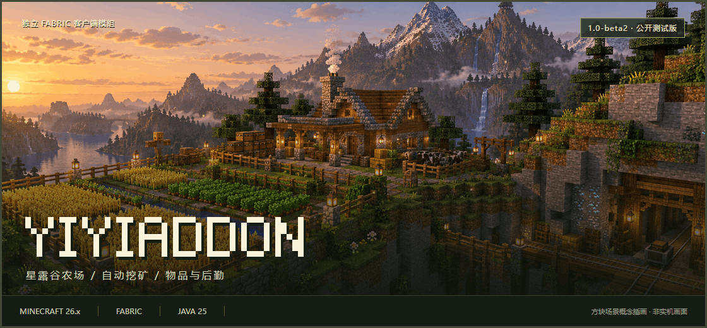

<p align="center">
  
</p>

<p align="center">
  <strong>种植、采掘、后勤，都有安排。</strong><br>
  Minecraft 26.x · 独立 Fabric 客户端模组
</p>

<p align="center">
  <a href="#星露谷农场">星露谷农场</a> ·
  <a href="#自动挖矿">自动挖矿</a> ·
  <a href="#功能概览">全部概览</a> ·
  <a href="#安装准备">安装准备</a> ·
  <a href="#版本状态">版本状态</a> ·
  <a href="https://github.com/fxjcangku/yiyiaddon/issues">问题反馈</a>
</p>

---

<p align="center"><a href="https://github.com/fxjcangku/yiyiaddon/releases/tag/v1.0-beta1"><strong>下载 Beta 测试版</strong></a> · <a href="展示资源/方块世界封面.png">查看静态封面</a></p>

### 从农田到矿洞

从模块中心找到功能，在独立页面中完成配置，通过控制台查看设置与运行状态。常用工具、自动化任务与世界标记，围绕同一套操作入口组织。

<table>
<tr>
<td width="33%" valign="top">
<h3>种植</h3>
<p>选择作物，圈定农田，设置配额。浇水、收获与种子补给按需安排。</p>
</td>
<td width="33%" valign="top">
<h3>采掘</h3>
<p>选择矿物，配置点位，管理工具与背包。采掘之外，也照顾卸货和补给。</p>
</td>
<td width="33%" valign="top">
<h3>后勤</h3>
<p>按数量取物，整理容器，准备附魔与交易。通过中文控制台查看和调整。</p>
</td>
</tr>
</table>

## 功能概览

以下是当前版本已接入的部分功能；具体可用范围以版本说明与实际测试结果为准。

| 方向 | 代表功能 | 使用场景 |
| :--- | :--- | :--- |
| 识别与整理 | ID 识别、ID 配置、自动箱子 | 管理目标信息与容器物品 |
| 采集与种植 | 自动挖矿、自动农场、自动骨粉 | 配置采集和种植任务 |
| 装备与交易 | 自动附魔、自动村民交易、自动图书管理员 | 管理附魔目标与交易流程 |
| 农场管理 | 星露谷农场 | 配置对应玩法的点位与任务 |
| 世界显示 | 水源显示、透视、ESP 设置 | 配置世界标记与可视信息 |

## 星露谷农场


**从一块种植区，到有计划的农场管理。**

面向 Minecraft 服务器中的星露谷类玩法，把作物选择、分区种植、日常照料与仓储后勤放进同一个控制台。这里的“星露谷农场”是本模组的功能模块，并非独立游戏《星露谷物语》的插件。

| 能力 | 你可以怎样使用 |
| :--- | :--- |
| 服务器资源识别 | 手动检测、提取当前服务器资源，选择该服真实存在的作物、种植盆和工具 |
| 分区与混种 | 圈定单作物区域，或在混种区按已选作物和目标数量安排种植 |
| 作物配额 | 每种作物分别设置目标数量，按个数或组数管理，不用给所有作物同一个目标 |
| 日常照料 | 按设置执行浇水、施肥、药剂使用与洒水器维护，并处理枯死作物 |
| 成熟与季节 | 根据已有规则和可确认的状态识别成熟；结合服务器季节与种子信息安排播种，支持人工确认 |
| 补给与仓储 | 绑定种子箱、成品箱和补水点，管理补货、卸货与多余种子回收 |
| 范围与状态 | 查看种植范围、洒水器覆盖、作物配额和当前任务，并通过日志回看状态 |

**六个页签，各司其职**

`概览` 当前任务与库存　 /　 `种植` 作物与工具　 /　 `运行` 作业参数<br>
`后勤` 数量与补给　 /　 `点位` 农田与设施　 /　 `日志` 状态回看

<details>
<summary><strong>第一次使用：从资源准备到开始种植</strong></summary>

1. 进入对应服务器，在模块页点击「检测 / 提取当前服务器资源包」。
2. 打开控制台，在「种植」页选择目标作物及实际使用的工具。
3. 在「点位」页的「农田」卡片圈地，确定单作物区或混种区。
4. 根据需求绑定种子箱、成品箱、补水点和洒水器。
5. 在「后勤」页设置各作物目标数量，检查运行参数后开启模块。

**使用前提：** 依赖对应服务器资源与玩法配置，不承诺兼容所有自定义农业服务器。缺少可靠成熟信息时需要确认规则；特殊作物也需要对应工具。首次使用建议从小块农田开始验证。

</details>

## 自动挖矿


**让采掘、卸货与补给，接成连续的工作流程。**

选择目标矿物并设置后勤点位后，通过 Baritone 执行寻路采掘，根据背包、饥饿与工具耐久条件切换任务。

| 环节 | 功能说明 |
| :--- | :--- |
| 采掘目标 | 配置目标矿物与相关采掘参数，通过寻路到达目标 |
| 满载卸货 | 达到设定条件后执行卸货流程，再返回采掘任务 |
| 食物补给 | 结合食物阈值与食物箱点位安排补给 |
| 工具维护 | 工具满足经验修补条件时，按耐久阈值进入对应修复流程 |
| 物品保留 | 通过保留白名单保护需要留下的物品，并管理搭路材料 |
| 手动接管 | 检测到非模块自身的大幅传送时暂停采掘，避免在落点继续挖掘 |
| 配置记录 | 保存设置与点位组合，按服务器查看和管理记录 |

**典型流程**

`前往采掘区域` → `寻路挖矿` → `检查背包 / 食物 / 耐久` → `卸货或补给` → `继续采掘`

<details>
<summary><strong>第一次使用：三个点位与一个必查设置</strong></summary>

1. 准备工具、食物及修复流程需要的装备和场地。
2. 在控制台「点位」页绑定矿物箱、食物箱、挂机修复点。
3. 配置服务器实际可用的传送指令与等待时间。
4. 选择目标矿物，检查满载、食物和耐久阈值。
5. **检查「保留白名单」再启动。非保留物品会被自动丢弃。**

传送流程需要服务器支持对应指令；普通无经验修补工具不能靠经验修复。运行时先停止模块再修改点位。本页不将尚未落地的种子预测挖矿、假矿检测作为可用功能宣传。

</details>

## 自动箱子

**按目标取物，也按你的习惯工作。**

支持玩家自行走位、自动寻路和保存点位三种工作方式。可以逐物品设置目标数量，也可以取空目标列表物品或全部合法物品。

- **目标更明确：** 结合 ID 目标列表选择物品，分别配置取物数量。
- **路线可选择：** 玩家控制模式随你的走位触发；寻路模式自动扫描；标点模式只处理保存点位。
- **操作有边界：** 容器类型、多人保护、重试与临时冷却分别配置。
- **状态便于查看：** 概览、点位、运行模式、容器、保护、取物和渲染分为七个页签。

## 自动农场

**面向原版作物，管理收割、补种与物流。**

与星露谷农场分开配置。通过两个角点确定农田范围，选择作物后安排收割、补种、拾取与箱子补给；每种启用作物可独立设置卸货与种子补货数量。

| 类型 | 当前说明列出的作物 |
| :--- | :--- |
| 普通作物 | 小麦、胡萝卜、马铃薯、甜菜根、下界疣 |
| 柱状作物 | 竹子、甘蔗、仙人掌 |
| 果实 | 南瓜、西瓜 |

最多同时启用三种作物；支持单个与批量收割。海带和甜浆果当前不在支持范围内。

## 自动附魔与村民交易

**从设定目标，到获得所需装备与物品。**

<table>
<tr>
<td width="50%" valign="top">
<h3>自动附魔</h3>
<p>区分原版装备、原版附魔书与自定义附魔模式，按目标词条组织配置。</p>
<p>根据模式执行经验准备、附魔、结果筛选、砂轮洗练与成品存放。支持纯附魔与挂机循环；需要先配置相应工作站、容器和经验来源。</p>
</td>
<td width="50%" valign="top">
<h3>自动村民交易</h3>
<p>提供原地交易、寻路单点与多任务模式，选择职业、物品和价格上限。</p>
<p>结合绿宝石箱与成品交易箱完成补给、交易和卸货。面向已准备好的固定交易所；相关村民需要先手动解锁到适用等级。</p>
</td>
</tr>
</table>

**自动图书管理员**则面向目标附魔书筛选：在符合要求的村民工位附近放置、拆除讲台以刷新交易，匹配目标后购买。使用前需准备讲台、书与绿宝石，并设置目标附魔及价格上限。

## 同一套操作方式

**模块中心 → 功能页面 → 控制台 → 配置与运行。**

常用功能通过统一入口查找，复杂模块用分页控制台组织设置。点位、目标选择和运行状态按模块呈现；ID 识别与配置用于管理目标信息，世界标记帮助查看区域和设施。具体操作以各模块页面内的中文说明为准。

---

## 安装准备

| 环境 | 当前版本要求 |
| :--- | :--- |
| 游戏 | Minecraft Java 版 **26.x**（当前支持 **26.1.2** 与 **26.2**；**26.3 及以后暂不支持**） |
| 加载器 | Fabric Loader **0.19.5 或更新兼容版本** |
| 基础依赖 | 与游戏版本对应的 Fabric API：26.1.2 用 **0.155.2+26.1.2**，26.2 用 **0.161.0+26.2** |
| Java | **25** |
| 系统 | 当前包包含 Windows x64 / ARM64 原生组件；其他系统暂未提供适配包 |

**安装步骤：**

1. 在启动器中创建对应游戏版本（**26.1.2** 或 **26.2**）的 Fabric 实例，选择 Java 25。
2. 下载与你游戏版本对应的包（文件名末尾带 MC 版本，如 `yiyiaddon-1.0-beta1-26.1.2.zip` / `yiyiaddon-1.0-beta1-26.2.zip`），解压后将其中的 JAR 和对应版本的 Fabric API 放入该实例的 `mods` 文件夹，不要直接放入 ZIP。
3. 启动游戏。升级已有实例前，先备份存档与配置。

Baritone 随包提供，无需另装。建议先在独立实例中测试。

## 版本状态

> **1.0-beta1 · Beta 公开测试版**
>
> 已完成构建检查与独立客户端启动验证，完整游戏内功能与长期性能仍待测试。本版为预发布版本，建议使用独立实例并备份存档和配置。

| 验证项目 | 当前状态 |
| :--- | :--- |
| 构建与发布包检查 | 已通过 |
| 独立 Fabric 客户端启动 | 已通过 |
| 游戏内完整功能与长期性能 | 待完成 |

<p>
  <a href="https://github.com/fxjcangku/yiyiaddon/releases"><strong>查看版本记录 →</strong></a>
</p>

## 问题反馈

请在 [Issues](https://github.com/fxjcangku/yiyiaddon/issues) 中附上版本、复现步骤、预期结果和实际结果。遇到崩溃时，可提供相关日志或崩溃报告；发送前请移除账号、令牌等个人信息。

<details>
<summary><strong>反馈内容参考</strong></summary>

```text
模组版本：
Minecraft / Fabric Loader / Fabric API 版本：
Java 版本与操作系统：
同时安装的其他模组：
复现步骤：
预期结果：
实际结果：
相关日志或截图：
```

</details>

---

### 作品与致谢

本仓库用于作品展示、版本说明与发布包分发。许可与第三方组件信息见 [LICENSE](https://github.com/fxjcangku/yiyiaddon/blob/master/LICENSE) 和 [CREDITS](https://github.com/fxjcangku/yiyiaddon/blob/master/CREDITS)，各组件遵循其原有许可。请尊重作者及第三方贡献者的成果。

<sub>Minecraft 是 Mojang Synergies AB 的商标。本项目是非官方客户端模组，与 Mojang 或 Microsoft 无关联。</sub>
