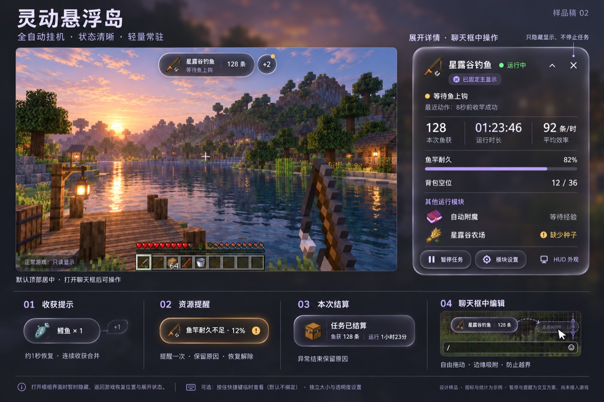
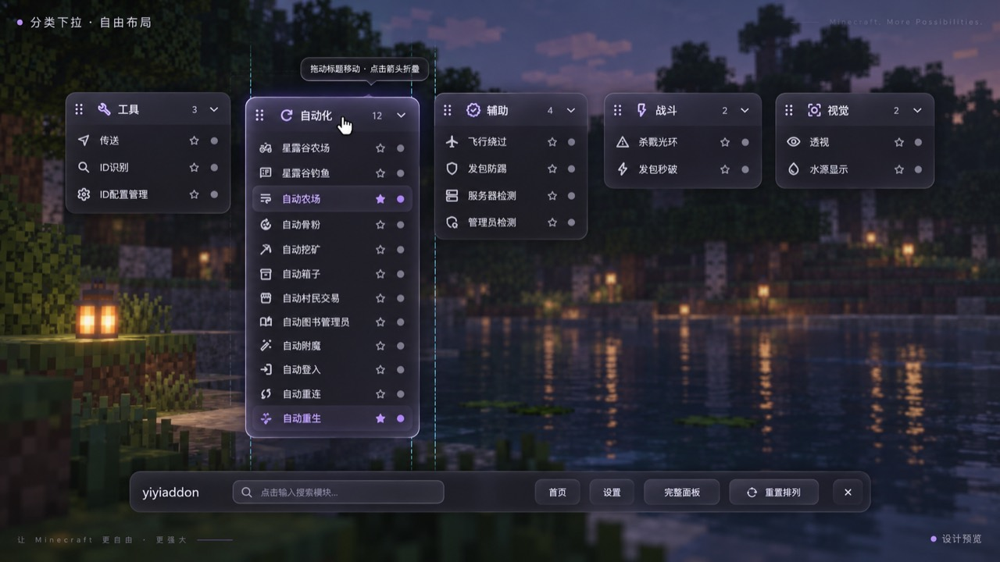
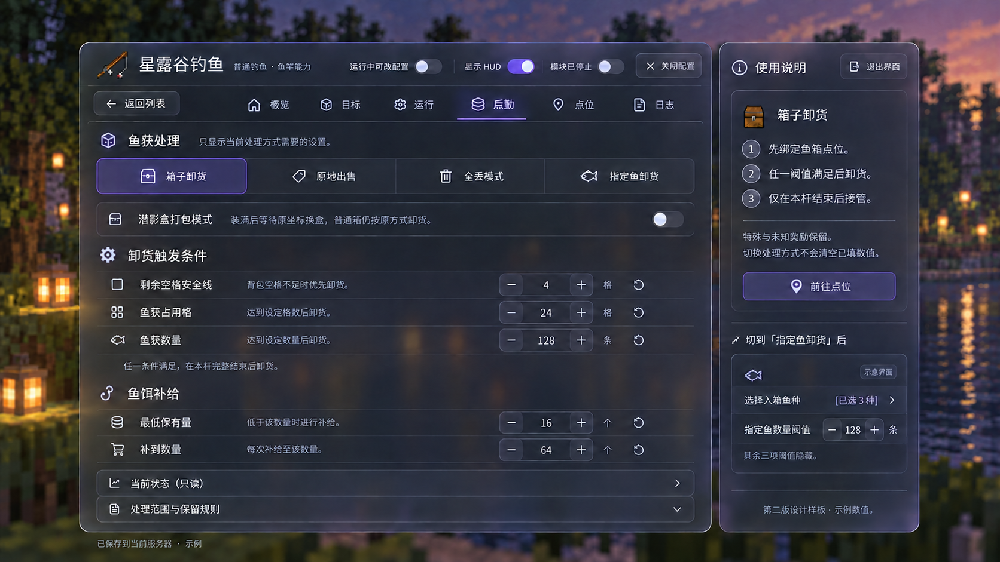

  

  <strong>把重复操作交给自动化，把注意力留给世界。</strong> 
  独立 Fabric 客户端模组 · 中文配置 · 模块状态与运行日志

  <a href="https://github.com/fxjcangku/yiyiaddon/releases"><strong>下载模组</strong></a>　·　
  <a href="界面预览.md">界面预览</a>　·　
  <a href="安装指南.md">安装指南</a>　·　
  <a href="功能指南.md">功能指南</a>　·　
  <a href="https://github.com/fxjcangku/yiyiaddon/issues">反馈问题</a>

## 从种植到后勤

作物、钓具、物资与点位按当前服务器配置；任务、配置和状态集中在一套中文界面中。按需要开启模块，看清它正在做什么、为什么等待。

| 模块 | 主要能力 |
| :--- | :--- |
| **星露谷农场** | 资源识别、分区种植、季节判断、照料收获与农场后勤。 |
| **星露谷钓鱼** | 浮漂判断、普通／岩浆／虚空钓鱼、鱼饵补给与鱼获处理。 |
| **自动附魔** | 四种模式、目标筛选、独立工作点与过程账目。 |
| **自动挖矿** | 目标采掘、种子预测验证、寻路、战斗与物资补给。 |
| **自动村民交易** | 按真实报价交易，搜索村民、补给、卸货与退料。 |

[查看完整功能指南 →](功能指南.md)

## 灵动岛，让运行状态看得见

小胶囊显示模块图标、当前状态和关键统计。打开聊天后点击展开，可以查看详细信息、切换主显示模块、暂停／继续或进入设置；隐藏 HUD 不停止任务。打开模组界面时临时收起，返回游戏后恢复。

本页界面图片为设计预览，数值与画面用于展示；具体布局和操作以游戏内界面为准。

## 两种布局，按你的习惯摆放

**完整面板**保留模块列表，切换配置更直接。**分类列表**可以拖动标题自由排列，支持折叠、吸附和位置保存；打开配置时专注当前模块，关闭后恢复列表。首页检查更新附近可以直接切换布局，在线玩家名单和反馈入口保留。

## 配置更集中，操作更顺手

配置按用途分组，说明靠近正在填写的选项；切换模式后，只显示对应设置。点位用紧凑行组织，图标、名称、状态与操作放在一起；调色盘集中色域、色相、透明度与数值输入，启动自检给出缺项和处理入口。

[查看点位、调色盘与启动自检图册 →](界面预览.md)

<strong>展开核心模块的详细能力</strong>

### 星露谷农场

> 进入服务器后，先认识这台服务器真实存在的作物与工具，再让它们参与种植计划。

- **资源自适应**：从当前服务器资源包学习真实存在的作物、种子、种植盆与工具；数据按服务器隔离，换服不会带走上一台服务器的农田与名单。
- **分区种植**：单作物区与混种区可以同时存在，每种作物有独立配额。
- **全流程管理**：自动处理播种、浇水、施肥、药剂、收获、枯死株与洒水器维护。
- **季节决策**：识别 HUD 中的季节与天数，让季节限制真正参与播种决策。
- **后勤闭环**：种子箱、成品箱、补水点和农田点位形成完整后勤闭环。
- **状态清晰**：中文状态、范围渲染和运行日志用于解释“现在为什么这样做”。
- **使用前提**：先等待服务器资源就绪，再配置区域、目标作物与后勤点位；换服后重新核对本服配置，不要照搬另一台服务器。

### 星露谷钓鱼

> 自动钓鱼不是固定延迟点击。它持续观察浮漂的运动、方向与时间关系，区分普通波动、网络积压和真实咬钩，再决定何时收竿。

- **状态一致**：在正常游戏、GUI 与背包打开状态下保持一致的计时与点击逻辑。
- **多重保护**：对高频更新、反向运动、过期证据和网络抖动设置独立保护。
- **可排查**：将“执行点击、服务器接受、成功钓获”分开记录，便于排查失败原因。
- **资源学习**：从当前服务器资源包识别钓具与鱼获；换服重新学习，不沿用上一服结果。
- **多环境抛竿**：普通与岩浆钓鱼使用钓点和 3×3 静止液体抛竿区域；岩浆需确认本服鱼竿能力，虚空使用独立站位与保存视角。
- **虚空模式**：可补珍珠、补经验，并将龙蛋与鞘翅分别存箱；只显示当前模式所需配置。
- **鱼获处理**：可选原地出售、箱子卸货或全丢；后勤任务依次执行，运行状态和结果可在模块详情核对。
- **目标管理**：鱼竿、鱼饵、鱼钩、鱼获图鉴和入箱摘要集中在「目标」页；鱼竿严格单选，鱼饵与鱼钩共用副手，不能同时选用。

### 自动附魔

> 原版附魔书、原版装备、自定义附魔书与自定义装备共四种模式，各自独立绑定与记账。

- **四种模式**：每种模式单独保存本服的箱子、工作点和挂机视角；首次使用需独立绑定，绑定后切回恢复各自配置，旧共享文件保留。
- **自定义装备**：每次处理一件——未命中洗练同一件，命中存成品，已识别诅咒送废物箱；沿用自定义书的目标匹配。
- **原版评分**：原版装备统一一种评分，比较真实合并收益、费用与操作惩罚；默认每批四件，可调数量，经验不足先归还原件再补给。
- **后台交接**：背包或箱子保持打开也可继续后台流程；停机重开优先续用原件；无法确认真实结果时不会重复附魔。
- **完成记录**：保存实际词条、次数与消耗；原版另列附魔和合并等级费用，只统计本轮培养区间。
- **安全寻路**：只走现有通路，不拆方块、不搭桥；目标被封住时先整理通路或调整点位。

### 自动挖矿

> 从种子预测到一整条挖矿班次：先算出矿物可能在哪，再交给自动挖矿去挖。

- **种子预测**：输入世界种子，本机独立计算进程离线推演矿物可能出现的位置；已加载区块会继续与真实方块对照。
- **假矿验证**：远处伪装外观不算有效证据，必须近距离无遮挡复核；已验证候选优先就近选择，并修正可直走路线的成本。
- **支持范围**：主世界支持钻石、红石、青金石、金、铁、铜、煤与绿宝石；下界支持远古残骸、下界石英与下界金，并使用独立验证证据。
- **标记语义**：青色、绿色、灰色与琥珀色标记分别表达预测、确认、缺失与调度敏感。
- **自动执行**：自动挖矿负责到达目标、破坏矿物、切换下一颗，并处理战斗、食物、耐久与卸货。
- **只看种子**：预测只看种子，不读取你的世界；关闭功能时计算进程完全不启动。

### 自动村民交易

> 按村民的真实报价交易、补给与卸货，材料与绿宝石的去向都有交代。

- **搜索范围**：寻路单点和多任务的横向、上下搜索范围独立设置；上下默认各 2 格，可调 1～256，按村民脚底与本轮启动时玩家脚底的真实高差判断。
- **补给与卸货**：先寻找箱旁约两格内可达的站位，再打开容器；售罄记录按村民保留，重新打开真实报价可更新库存判断，补货倒计时只是预计时间。
- **物资标签**：常驻显示实际物品图标，不必用准星指向。
- **菜单兼容**：后台旧交易菜单可以重开当前目标，避免把整排村民误当失败；无法确认的菜单留给手动处理。
- **容量规划**：出售材料不设补给量时，多种材料共同为绿宝石产出留空间；交易按真实付款、产出和找回材料核对容量。
- **不丢材料**：材料塞满且没有绿宝石可卸时，只退一整槽已选材料到它自己的绑定箱，再继续原目标，绝不丢弃。

---

## 其他模块

模块中心还包含 ID 识别与配置、自动箱子、原版自动农场、自动骨粉、图书管理员、世界显示与 ESP 等功能。公开测试阶段会优先保证核心链路，再逐项扩大实机覆盖；各模块有独立前置条件，覆盖程度不同。

[功能指南](功能指南.md) · [服务器使用注意](服务器使用注意.md) · [常见问题](常见问题.md)

## 三步开始

1. **选对版本。** 到[下载页](https://github.com/fxjcangku/yiyiaddon/releases)选择与你的 Minecraft 对应的安装包。
2. **装进实例。** 解压后将 JAR 和对应 Fabric API 放进 `mods`；移出重复旧 JAR，无需另装 Baritone。
3. **打开配置。** 默认按 **G**，先补齐自检提示的点位、物品和条件，再启动模块。

| Minecraft | 配套 Fabric API |
| :--- | :--- |
| **26.1.2** | `0.155.2+26.1.2` |
| **26.2** | `0.161.0+26.2` |

Java 25 · Fabric Loader 0.19.5 或更新兼容版本。可用平台以下载页对应安装包说明为准。

**更新与配置**：退出客户端后替换旧 JAR，再启动；原配置保留。首次使用建议建立独立实例并备份存档与配置。

配置分享与首次使用

进入「设置 → 配置分享」，可向同一 Minecraft 版本的另一台电脑或独立实例导出、导入配置 ZIP；支持选择是否携带当前服务器资料。

- 自动登录密码不导出，本机已有密码保留。
- 导入确认后先排队，可在页面取消；退出当前世界后自动应用。
- 应用后模块保持关闭，检查本服配置与点位再开启。
- 世界选点时暂时回到游戏，确认后重新打开仍回到原模块。

[完整安装与配置指南 →](安装指南.md)

## 交流与反馈

各模块的实机覆盖不同，服务器功能以本服资源、插件与规则为准。介绍图册包含设计预览；下载包的内容和验证范围以对应发布说明为准。

[提交 GitHub Issue](https://github.com/fxjcangku/yiyiaddon/issues/new?template=bug_report.md) · [Discord 社区](https://discord.gg/vwrRCtET) · [更新日志](更新日志.md)

反馈时附模组／游戏版本、复现步骤、预期与实际结果及相关日志，发送前移除账号、令牌和个人信息。

在线状态与隐私说明

- 在线名单不显示完整玩家名，本人账户区仍保留完整名称与头像。
- 主页保留正版状态、在线人数、用户排行、累计使用人数、网络地区、IP 与最后同步时间。
- 后端只维护在线统计、公开排行所需的最小账号状态，以及玩家主动使用的管理员聊天。
- 不收集玩家坐标、生命、服务器、模块开关、崩溃详情或指令记录。
- IP 与网络地区由客户端在本机查询后直接展示，不写入 yiyiaddon 后端；管理员聊天仅用于玩家与维护者沟通。

---

顶部动图为功能概念示意；界面样板和实机截图分别标注。Minecraft 是 Mojang Synergies AB 的商标，本项目与 Mojang 或 Microsoft 无关联。
