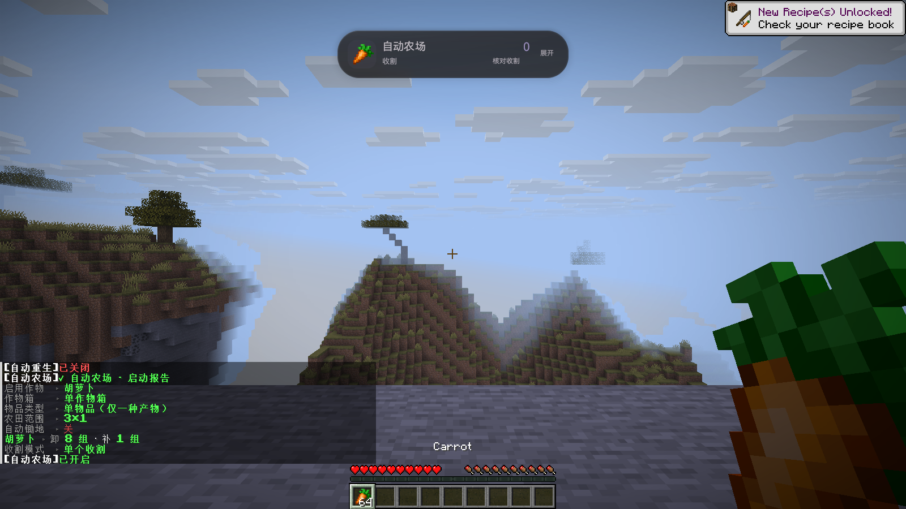
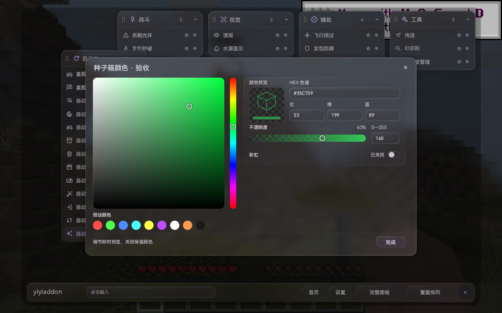
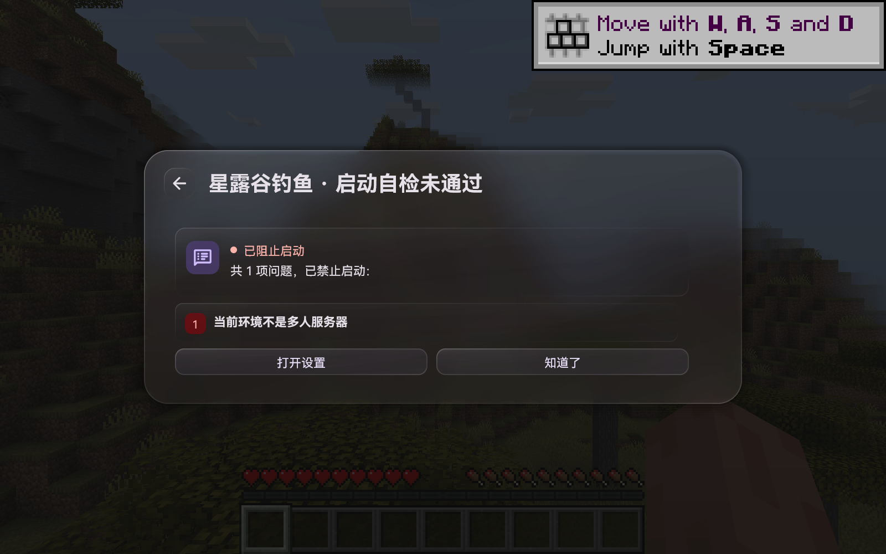

# beta9 · 液态玻璃界面预览

**下一版预览，尚未发布。** 当前可下载版本仍为 [1.0-beta8](https://github.com/fxjcangku/yiyiaddon/releases/tag/v1.0-beta8)，不包含本页展示的新界面与灵动岛。

[返回介绍页](README.md) · [查看当前版本](https://github.com/fxjcangku/yiyiaddon/releases/tag/v1.0-beta8) · [反馈问题](https://github.com/fxjcangku/yiyiaddon/issues)

这次把首页、配置页、点位、调色盘、自检与运行状态放进同一套液态玻璃风格。下面五张均为 **Minecraft 26.2 开发版的单人实机原图**，没有用概念稿替代游戏画面。

## 01 · 完整面板，保留熟悉的入口

模块列表常驻，切换模块不用反复返回。配置页采用轻量页签、紧凑分组与就近说明；点位名称、状态和操作放在同一行，窄窗口自动调整排列。

首页保留在线人数、玩家名单、反馈入口及原有内容；界面模式按钮放在检查更新附近。模块页也有显眼的「显示灵动岛」开关。

## 02 · 分类列表，按你的习惯摆放

拖住分类标题即可移动，位置会保存；拖动抬起、边缘吸附与落位有连续反馈。

只有分类列表模式打开模块配置时，背后的分类与底栏才会隐藏。关闭配置恢复原排列；「退出界面」返回游戏。完整面板一直保留模块列表。

## 03 · 灵动岛，让等待有原因

收起时显示模块图标、当前状态与关键统计。展开后查看详细信息和最近动作，支持固定主模块、切换任务及按模块命名的暂停／继续按钮。

- **打开聊天后点击胶囊展开**，使用游戏已有鼠标操作，无需另记交互快捷键。
- **隐藏 HUD 不会停止任务**，在模块配置页可以重新打开显示。
- **主界面打开时临时隐藏**，退出整套界面后按显示设置恢复，不与配置页面重叠。
- **资源提醒与本次结算**说明缺什么、为何等待或停止；大小、透明度和减少动画可独立调整。

上图为真实原版农场运行状态；服务器钓鱼、网络延迟与长时间挂机仍需对应环境验证。

## 04 · 调色更直观，输入更集中

方形色域、竖向色相、圆形预设与 HEX／RGB 输入集中排列。透明度有棋盘预览，支持即时查看颜色；窄窗口改为上下布局，沿用原有配置保存方式。

## 05 · 自检先讲清问题，再给入口

启动前展示具体缺项和处理入口，可以直达对应模块配置。图中展示单人环境下钓鱼模块的真实自检结果，没有改变原启动条件。

## 当前进度

26.1.2 与 26.2 已完成本地接入、构建及单人界面和 HUD 检查。beta9 的公开安装包尚未发布；原服务器、输入法、长时间挂机和最终安装包验证仍在准备。

beta9 计划提供两个 **Windows x64** 安装包，分别对应 Minecraft 26.1.2 和 26.2。Minecraft 26.3 暂不提供下载。

[回到首页 →](README.md)
