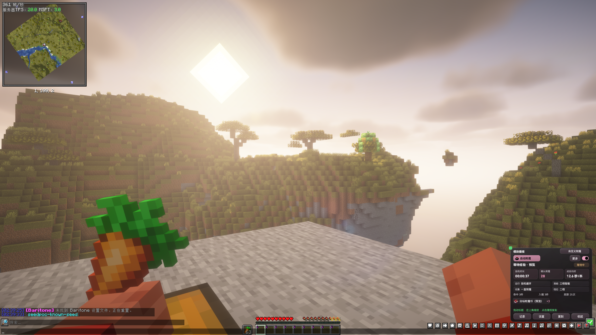

# Beta9.1界面预览

本轮重点：**通知集中、不再刷聊天；安装包精简为 Windows x64，按游戏版本单独下载。** 默认采用「精致窄形」，附魔时长、确认次数与成品均时三个指标同屏，绿色操作提示放在面板内部；另保留横向状态栏和精致方形。

   
  26.2 单人客户端原图；12.6 秒/本及数量均为演示数据，不代表实测速度或原服收益。<a href="界面预览.md#此前方形效果展示">此前河畔方形效果图与原图对照</a>

8 秒没有新播报时整个面板隐藏，新播报或打开聊天框后恢复；历史可筛选、复制，同服关闭模块不清账目。打开聊天后可以拖动、缩放，主题随主界面切换。

**Beta9.1 公开测试版。** 两版单人客户端已验证界面、配置读回及本轮附魔满包、前台交接、延迟恢复；最终混淆包已进入单人世界并完成本轮专项；原服务器业务与长期挂机未验。更新窗口已做深浅主题、窄窗与局部滚动检查，正式下载以发布页为准。

[查看完整界面预览 →](界面预览.md) · [返回介绍页](README.md)
