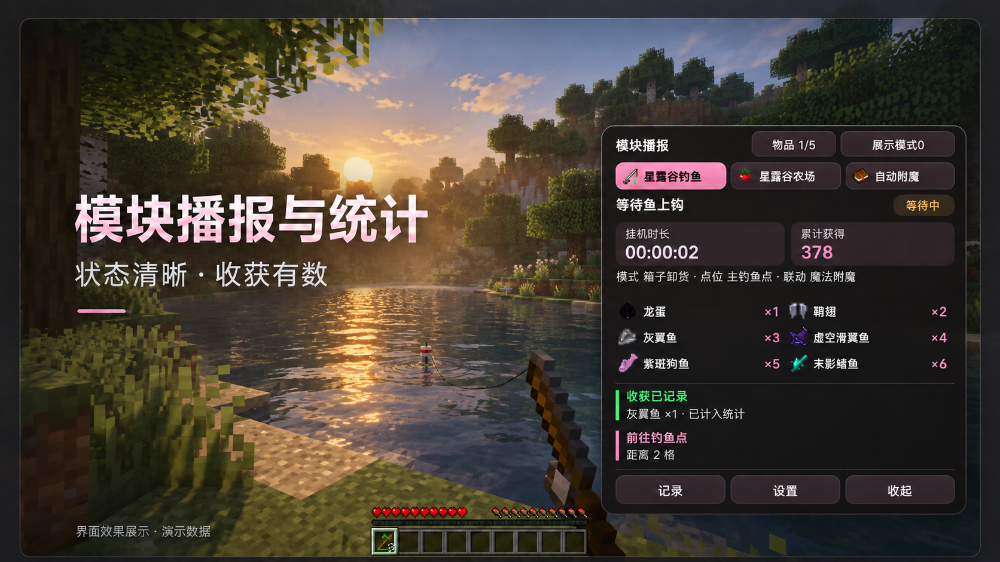

# 界面预览入口

本轮重点：**模块通知集中到右下角，不再刷聊天；安装包精简，按游戏版本单独下载。** 图册展示「精致方形」客户端预览，并保留分类列表、模块配置、点位、调色盘和自检样板。

   
  图片编辑后的界面效果展示，数量为演示数据。<a href="展示资源/模块播报统计-20261008/精致方形-客户端预览.png">查看原始客户端截图</a>

**新版功能尚未随公开安装包交付。** 26.1.2 / 26.2 单人客户端已验证界面交互和配置读回，原服务器业务与长期挂机尚未验。此入口不代表 beta9 已发布。

[查看完整界面预览 →](界面预览.md) · [返回介绍页](README.md)
