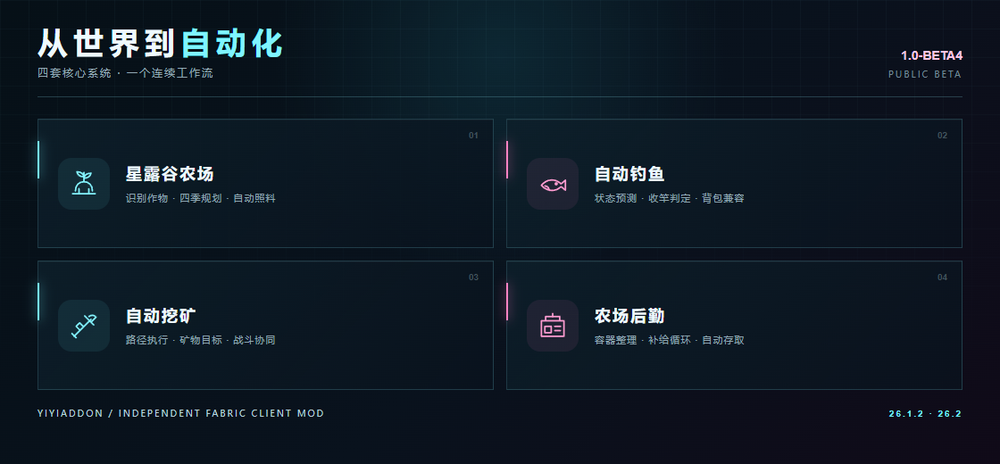

# 功能指南

概念图用于介绍功能，不是实机截图。具体设置和当前限制以游戏内模块说明为准。

## 星露谷农场

适用于具有星露谷作物与资源的服务器。先等待服务器资源就绪，再配置区域、目标作物及后勤点位；检查季节、种子、工具与容器条件后启动。

运行中通过控制台状态和日志查看当前任务。不同服务器的资源与点位不同，换服后应重新核对本服配置，不要直接照搬另一台服务器的设置。

## 自动钓鱼

用于自动钓鱼流程中的状态判断与操作。先按游戏内说明完成配置，并在目标服务器验证收竿与钓获是否正常，再考虑长时间运行。

出现问题时请区分：没有执行操作、执行后服务器没有响应、服务器响应但没有钓获。反馈时注明是否打开背包或其他界面，有助于复现。

## 种子挖矿

先输入正确的世界种子，观察预测与真实方块的验证状态；证据不足时不能把预测直接当作可靠目标。主世界与下界分别验证，换维度不能沿用旧证据。

主世界支持钻石、红石、青金石、金、铁、铜、煤、绿宝石；下界支持远古残骸、下界石英、下界金。预测位置不等于服务器最终一定存在矿物，服务器自定义生成与防矿透环境可能影响结果。

## 自动挖矿与后勤

自动挖矿负责目标、路径、采掘与相关补给流程。启动前核对食物、工具、耐久和卸货条件；使用种子目标时还需通过对应验证。

自动箱子、农场补给与卸货依赖正确绑定的容器。出现等待或暂停时先看控制台原因；不要只凭角色没有移动就判断模块失效。

## 其他模块

模块中心还提供 ID 识别、原版自动农场、自动骨粉、自动附魔、村民交易、图书管理员与世界显示等功能。各模块有独立前置条件，公开测试阶段的覆盖程度不同。

[安装指南](安装指南.md) · [常见问题](常见问题.md) · [返回首页](README.md)
