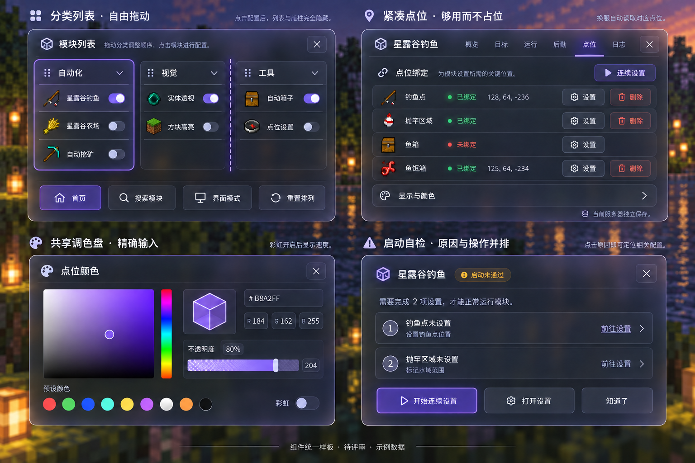
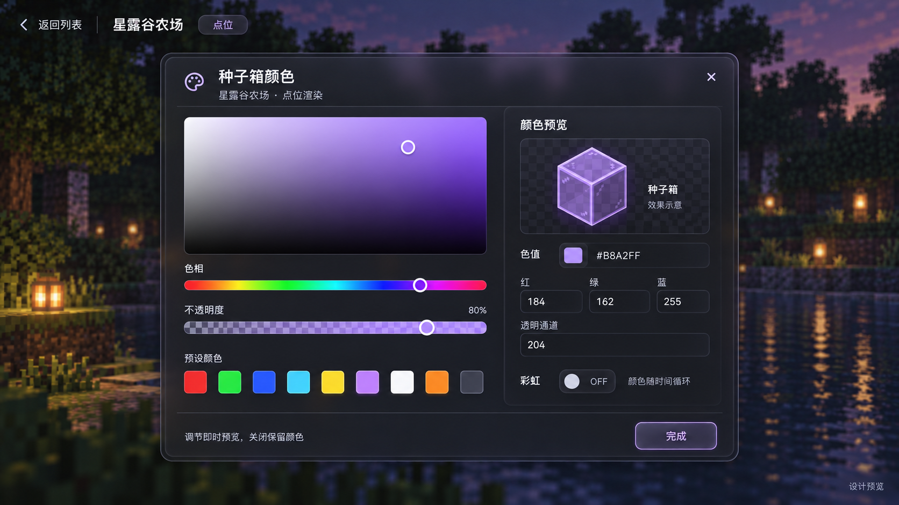
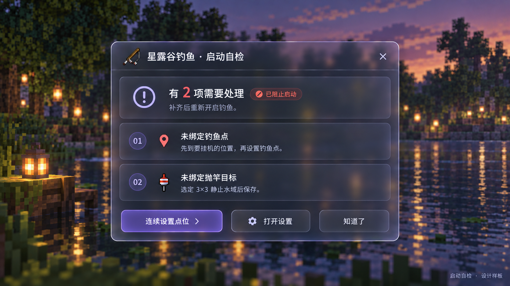
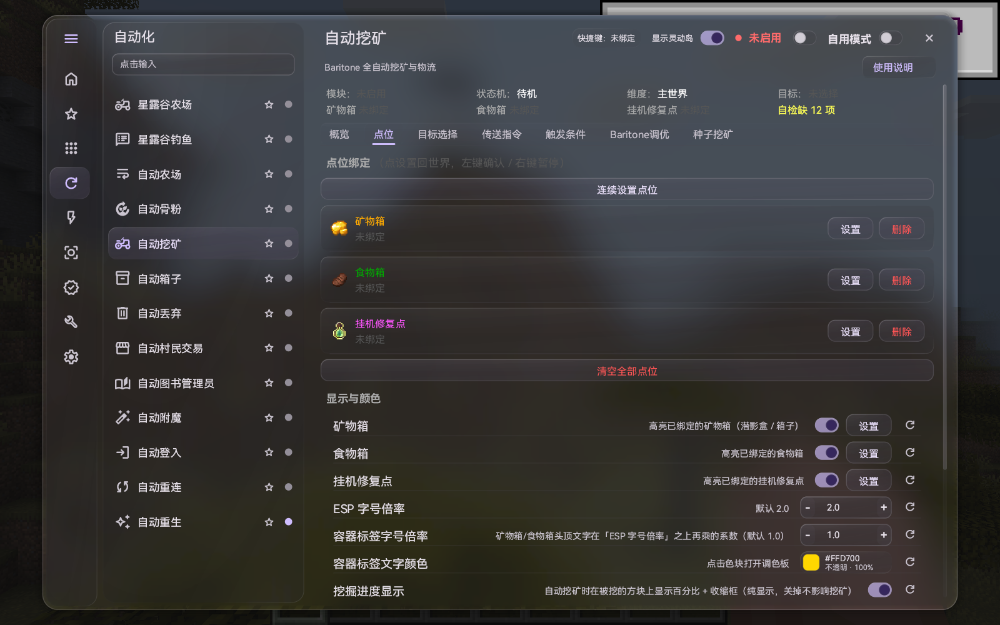
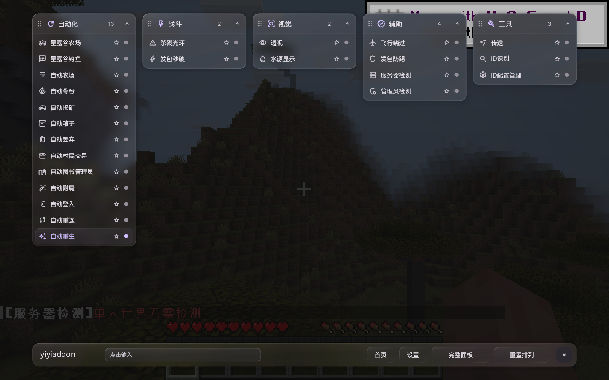

# 液态玻璃界面预览

中文模块配置、灵动岛运行状态与自由排列的分类列表。下面六张为 **2026-10-08 的设计预览**，示例数值仅用于展示，具体布局和操作以游戏内界面为准。

[返回介绍页](README.md) · [下载模组](https://github.com/fxjcangku/yiyiaddon/releases) · [功能指南](功能指南.md) · [反馈问题](https://github.com/fxjcangku/yiyiaddon/issues)

## 灵动岛：收起轻量，展开清楚

状态、产量、运行时间和资源提醒集中展示。打开聊天后点击胶囊展开，使用游戏已有鼠标操作；隐藏 HUD 与暂停任务分开，进入主界面时临时收起。

## 分类列表：自由摆放，位置保存

拖住分类标题移动，点击标题折叠；支持吸附和位置保存。只有分类列表模式进入配置时隐藏列表，关闭后恢复；完整面板保留模块列表。

## 模块配置：模式对应设置，说明放在旁边

按概览、目标、运行、后勤、点位与日志组织配置，切换模式时只显示相关选项。使用说明与当前操作并排，减少来回查找。样板中的个别旧按钮仅作视觉示意，最终配置页按现有交互实现。

## 点位与交互：紧凑布局，入口清楚

点位将名称、状态与设置操作放在一行，保留真实物品图标；窄窗口调整排列。颜色编辑和自检采用同一套玻璃材质、间距与按钮样式。

## 调色盘：看得见，也能精确输入

色域、色相、透明度、预设与 HEX／RGB 输入集中排列，预览帮助确认当前颜色；设置沿用原有保存方式。

## 启动自检：先说明缺项，再给处理入口

启动前展示所需点位、物品与条件，处理入口直达对应模块配置。

## 查看实际客户端画面

以下是开发客户端的单人实机原图，供对照实现；各安装包的内容与验收范围以对应下载页说明为准。

| 完整面板 | 分类列表 |
| :---: | :---: |
|  |  |

[回到首页 →](README.md)
